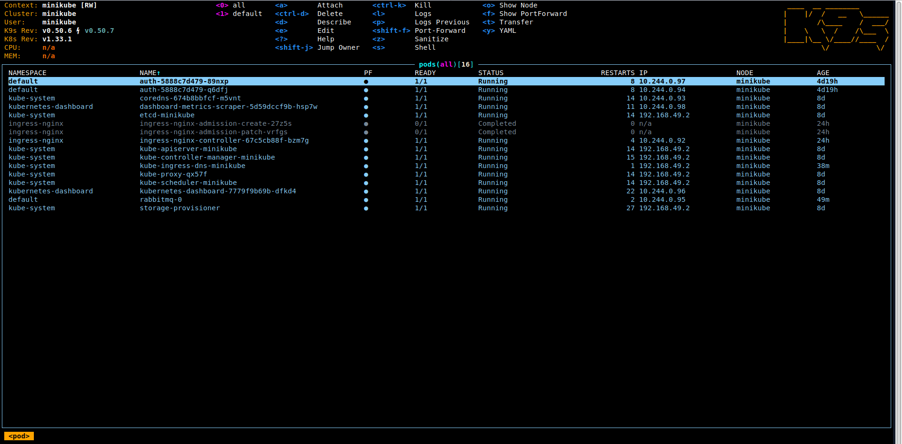
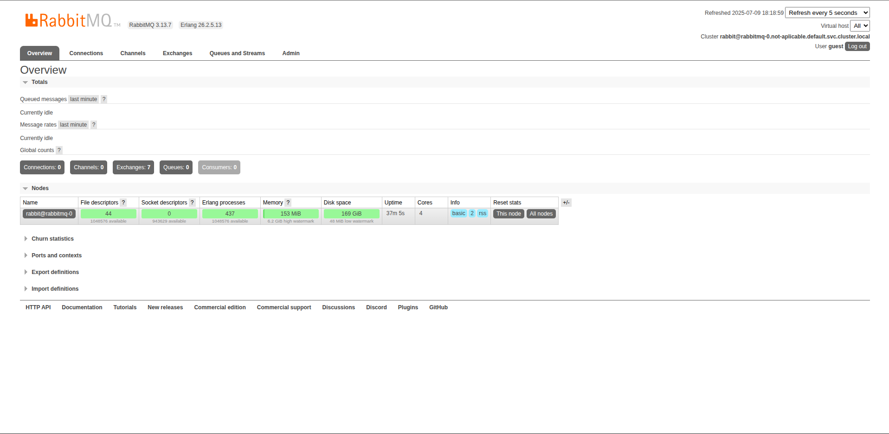
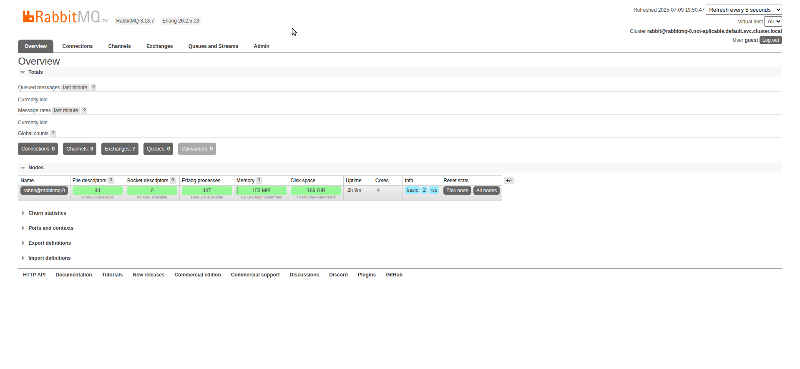
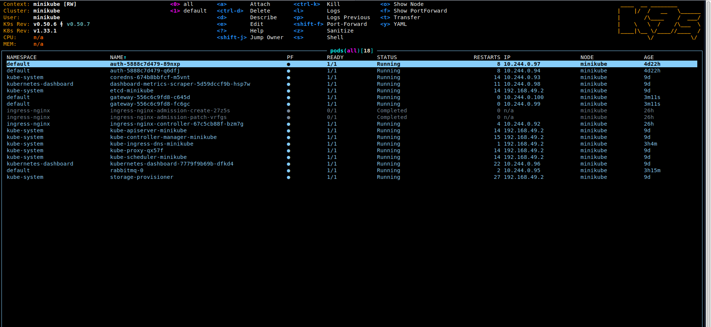

## Microservice Architecture System

This is a project I've always have the desire to code, but did not have the time to do it before, and wanted to make my own modifications and improvements (i.e, add new features).

The initial code is based on the tutorial from [freecodecamp youtube channel](https://www.youtube.com/@freecodecamp) called [**Microservice Architecture and System Design with Python & Kubernetes – Full Course**](https://www.youtube.com/watch?v=hmkF77F9TLw).


## Project File Structure

```
.
├── docker-compose.yml
├── init.sql
├── LICENSE
├── python
│   └── src
│       ├── auth
│       │   ├── Dockerfile
│       │   ├── manifests
│       │   │   ├── auth-deploy.yaml
│       │   │   ├── auth-secret.yaml
│       │   │   ├── configmap.yaml
│       │   │   ├── secret.yaml
│       │   │   └── service.yaml
│       │   ├── requirements.txt
│       │   └── server.py
│       ├── converter
│       │   ├── consumer.py
│       │   ├── Dockerfile
│       │   ├── manifests
│       │   │   └── converter-deploy.yaml
│       │   ├── mp3_converter.py
│       │   └── requirements.txt
│       ├── gateway
│       │   ├── Dockerfile
│       │   ├── login_service.py
│       │   ├── manifests
│       │   │   ├── configmap.yaml
│       │   │   ├── gateway-deploy.yaml
│       │   │   ├── ingress.yaml
│       │   │   ├── secret.yaml
│       │   │   └── service.yaml
│       │   ├── requirements.txt
│       │   ├── server.py
│       │   ├── uploader.py
│       │   └── validate_service.py
│       └── rabbitmq
│           └── manifests
│               ├── configmap.yaml
│               ├── ingress.yaml
│               ├── pvc.yaml
│               ├── secret.yaml
│               ├── service.yaml
│               └── statefulset.yaml
├── README.md
└── static
    ├── create-video-queue.gif
    ├── gateway-service-kubernetes.gif
    ├── rabbitmq-manager.png
    ├── rabbitmq-minikube-pod.gif
    └── video-thumbnail.jpg


```

## Prerequirements

@TODO

## Create docker image, tag it and upload to a docker hub repository

@TODO Explain how to create a Dockerfile

@TODO Explain how to build an image

@TODO Explain how to tag an image

@TODO Explain how to push as image to the docker hub repository (docker login, etc.)


## Create config files for kubernetes to pull the images

@TODO Explain the main concepts in deploy, configmap, secret, service, ingress, stateful and pcv yaml files

@TODO Create a shellscript to do it - enter in manifests files and _**run kubctl apply -f ./**_

## Add host entries defined in the _rules_ section of the _ingress.yaml_ files:

- Enable minikube addons for ingress:

```bash
$ minikube addons ingress enable
$ minikube addons enable ingress-dns
```

- You can see the list of enabled / disabled addons with the following command:

```bash
$ minikube addons list
```

- Start minikube tunnel:

```bash
$ minikube tunnel
```

- Get the IP address maped from minikube to the hosting machine:

```
Status:
	machine: minikube
	pid: 11200
	route: 10.96.0.0/12 -> 192.168.49.2
	minikube: Running
	services: []
    errors:
		minikube: no errors
		router: no errors
		loadbalancer emulator: no errors

```

- In this case is '**192.168.49.2**' (route property), so you have to update the hosts file in /etc directory:

```bash
$ sudo nano /etc/hosts
```

- Add the following entries:

```
# Kubernetes and docker
192.168.49.2	kubernetes.docker.internal
192.168.49.2	mp3converter.local
192.168.49.2	rabbitmq-manager.local

```

## Access rabbitmq manager:

- Start **minikube**:

```bash
$ minikube start
```

- Start **k9s**:

```bash
$ k9s
```

- In the **k9s** hit 'enter' key on the rabbit-mq pod and 'ctrl + s' to start the container shell, as showing in the following image:



- At the container shell type the command:

```bash
rabbitmq-plugins enable rabbitmq_management
```

- Access http://rabbitmq-manager.local/ on the browser. Enter the username **_"guest"_** and password **_"guest"_** and you should see:



## Create queues (video and mp3)

- To create **_video_** queue just add it in the **_Queues and Streams_** section with the option **_Durability_** set to **_Durable_** to maintain queue messages even though the pods crashes or restarts:




- Start the gateway service in **./python/src/gateway/manifests** directory by running the following command:

```bash
$ kubctl apply -f ./
```

- You should check the service running by clicking on the pod on k9s:




## Create secret token using python

```python
import secrets

# Generate a 32-byte (64-character hex string)
secret_key = secrets.token_hex(32)
print(f"Hexadecimal secret key: {secret_key}")
```

## Running the application

- First start docker container:

```bash
$ docker-compose up
```

@TODO

## Good practices in a production environment

- Do not push configmap / secret files (.yaml files) containing env variables to the repository.

## Explanation of the docker-compose.yml file (at the root of the application):

```yml
version: '3.8': Specifies the Docker Compose file format version.

services: Defines the services (containers) that make up your application.
    mysql_db: The name of your MySQL service.
    image: mysql:8.0: Uses the official MySQL 8.0 Docker image. You can specify a more precise version if needed (e.g., mysql:8.0.30).
    container_name: mysql_8_database: Assigns a custom name to your container for easier identification.
    restart: always: Ensures the container restarts automatically if it stops or the Docker daemon restarts.
    environment: Sets environment variables within the container.
        MYSQL_ROOT_PASSWORD: Sets the password for the root user.
        MYSQL_DATABASE: Creates a new database with the specified name when the container starts.
        MYSQL_USER: Creates a new user with the specified username (do not use "root").
        MYSQL_PASSWORD: Sets the password for the new user.
    ports: - "3306:3306": Maps port 3306 on your host machine to port 3306 inside the container, allowing external connections to MySQL.
    volumes:
        - mysql_data:/var/lib/mysql: Mounts a named volume (mysql_data) to the /var/lib/mysql directory inside the container. This persists your database data even if the container is removed.

volumes: Defines the named volumes used in your services.
    mysql_data: The named volume for your MySQL data.
        driver: local: Specifies that the volume should be stored locally on your host machine.
```

## Problems faced at the initial setup:

- Exception: Can not find valid pkg-config name.
- Specify MYSQLCLIENT_CFLAGS and MYSQLCLIENT_LDFLAGS env vars manually

```bash
$ sudo apt-get install pkg-config python3-dev default-libmysqlclient-dev build-essential
```

## References

- [**Kubernetes**](https://kubernetes.io/)
- [**minikube**](https://minikube.sigs.k8s.io/)
- [**k9s**](https://github.com/derailed/k9s)
- [**Python 3**](https://www.python.org/)
- [**Flask (python framework)**](https://flask.palletsprojects.com/)
- [**RabbitMQ**](https://www.rabbitmq.com/)
- [**MDN Web Docs**](https://developer.mozilla.org/)
- [**Docker**](https://www.docker.com/)
- [**MoviePy**](https://pypi.org/project/moviepy/)
