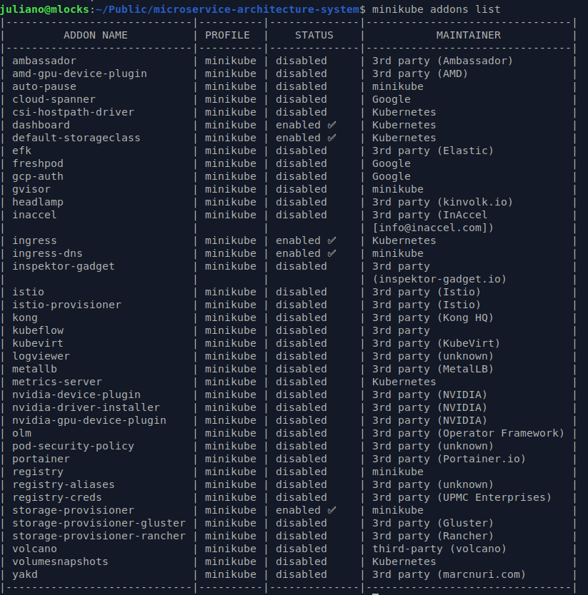

## Microservice Architecture System $${\color{red}[in \space progress]}$$

This is a project I've always have the desire to code, but did not have the time to do it before, and wanted to make my own modifications and improvements (i.e, add new features).

The initial code is based on the tutorial from [freecodecamp youtube channel](https://www.youtube.com/@freecodecamp) called [**Microservice Architecture and System Design with Python & Kubernetes – Full Course**](https://www.youtube.com/watch?v=hmkF77F9TLw).


## Project File Structure

```
.
├── init.sql
├── LICENSE
├── python
│   └── src
│       ├── auth
│       │   ├── auth_service.py
│       │   ├── Dockerfile
│       │   ├── manifests
│       │   │   ├── auth-deploy.yaml
│       │   │   ├── configmap.yaml
│       │   │   ├── secret.yaml
│       │   │   └── service.yaml
│       │   ├── requirements.txt
│       │   └── server.py
│       ├── converter
│       │   ├── consumer.py
│       │   ├── Dockerfile
│       │   ├── manifests
│       │   │   ├── configmap.yaml
│       │   │   ├── converter-deploy.yaml
│       │   │   └── secret.yaml
│       │   ├── mp3_converter.py
│       │   └── requirements.txt
│       ├── gateway
│       │   ├── Dockerfile
│       │   ├── login_service.py
│       │   ├── manifests
│       │   │   ├── configmap.yaml
│       │   │   ├── gateway-deploy.yaml
│       │   │   ├── ingress.yaml
│       │   │   ├── secret.yaml
│       │   │   └── service.yaml
│       │   ├── requirements.txt
│       │   ├── server.py
│       │   ├── uploader.py
│       │   └── validate_service.py
│       ├── mysql
│       │   └── manifests
│       │       ├── configmap.yaml
│       │       ├── pod.yaml
│       │       ├── secret.yaml
│       │       └── service.yaml
│       └── rabbitmq
│           └── manifests
│               ├── configmap.yaml
│               ├── ingress.yaml
│               ├── pvc.yaml
│               ├── secret.yaml
│               ├── service.yaml
│               └── statefulset.yaml
├── README.md
└── static
    ├── create-video-queue.gif
    ├── gateway-service-kubernetes.gif
    ├── minikube-addons-list.png
    ├── minikube-tunnel.gif
    ├── rabbitmq-manager.png
    ├── rabbitmq-minikube-pod.gif
    ├── video-beauty-of-math.mp4
    └── video-thumbnail.jpg

```

## Prerequirements

- This is some previous knowledge and technologies necessary to follow along and understand this tutorial:

@TODO 

## Create docker image, tag it and upload to a docker hub repository

@TODO Explain how to create a Dockerfile

@TODO Explain how to build an image

@TODO Explain how to tag an image

@TODO Explain how to push an image to the docker hub repository (docker login, etc.)


## Create config files for kubernetes to pull the images

@TODO Explain the main concepts in deploy, configmap, secret, service, ingress, stateful and pcv yaml files

@TODO Create a shell script to do it - enter in manifests directory and _**run kubctl apply -f ./**_

## Enable minikube addons for ingress:

- Run the following commands:

```bash
$ minikube addons enable ingress
```

```bash
$ minikube addons enable ingress-dns
```

- You can see the list of enabled / disabled addons with the following command:

```bash
$ minikube addons list
```

- The output shows the enabled addons:
 


## Start **minikube** and tunneling feature:

```bash
$ minikube start
```

- Start the minikube tunneling feature (to map a cluster internal IP to a local IP):

```bash
$ minikube tunnel
```

- You should see the output above:


## Add host entries defined in the _rules_ section of the _ingress.yaml_ files:

- Get the IP address mapped from minikube to the hosting machine:

```
Status:
	machine: minikube
	pid: 11200
	route: 10.96.0.0/12 -> 192.168.49.2
	minikube: Running
	services: []
    errors:
		minikube: no errors
		router: no errors
		loadbalancer emulator: no errors

```

- In this case is '**192.168.49.2**' (route property), so you have to update the hosts file in /etc directory:

```bash
$ sudo nano /etc/hosts
```

- Add the following entries:

```
# Kubernetes and docker
192.168.49.2	kubernetes.docker.internal
192.168.49.2	mp3converter.local
192.168.49.2	rabbitmq-manager.local

```

## Access rabbitmq manager:

- Start **k9s**:

```bash
$ k9s
```

- In the **k9s** hit 'enter' key on the rabbit-mq pod and 'ctrl + s' to start the container shell, as showing in the following image:


- At the container shell type the command:

```bash
rabbitmq-plugins enable rabbitmq_management
```

- Access http://rabbitmq-manager.local/ on the browser. Enter the username **_"guest"_** and password **_"guest"_** and you should see:


## Create queues (video and mp3)

- To create <u>**_video_**</u> and <u>**_mp3_**</u> queues, just add it in the **_Queues and Streams_** section with the option **_Durability_** set to **_Durable_** to maintain queue messages even though the pods crashes or restarts:


- Start the gateway service in **./python/src/gateway/manifests** directory by running the following command:

```bash
$ kubctl apply -f ./
```

- You should check the service running by clicking on the pod on k9s:


## Create secret token using python

```python
import secrets

# Generate a 32-byte (64-character hex string)
secret_key = secrets.token_hex(32)
print(f"Hexadecimal secret key: {secret_key}")
```

## Running the application

- First start docker container:

```bash
$ docker-compose up
```
@TODO

## Endpoints

@TODO

## Good practices in a production environment

- Do not push configmap / secret files (.yaml files) containing env variables to the repository.

## Problems faced at the initial setup:

- Exception: Can not find valid pkg-config name.
- Specify MYSQLCLIENT_CFLAGS and MYSQLCLIENT_LDFLAGS env vars manually

```bash
$ sudo apt-get install pkg-config python3-dev default-libmysqlclient-dev build-essential
```

MySQL connection error between pods.

```bash
 [2025-08-05 18:28:17,282] ERROR in app: Exception on /login [POST]                                                                                                                                              │
 Traceback (most recent call last):                                                                                                                                                                              │
   File "/usr/local/lib/python3.10/site-packages/flask/app.py", line 1511, in wsgi_app                                                                                                                           │
     response = self.full_dispatch_request()                                                                                                                                                                     │
   File "/usr/local/lib/python3.10/site-packages/flask/app.py", line 919, in full_dispatch_request                                                                                                               │
     rv = self.handle_user_exception(e)                                                                                                                                                                          │
   File "/usr/local/lib/python3.10/site-packages/flask/app.py", line 917, in full_dispatch_request                                                                                                               │
     rv = self.dispatch_request()                                                                                                                                                                                │
   File "/usr/local/lib/python3.10/site-packages/flask/app.py", line 902, in dispatch_request                                                                                                                    │
     return self.ensure_sync(self.view_functions[rule.endpoint])(**view_args)  # type: ignore[no-any-return]                                                                                                     │
   File "/app/server.py", line 59, in login                                                                                                                                                                      │
     user = auth_service.get_username_by_email(auth.username)                                                                                                                                                    │
   File "/app/auth_service.py", line 59, in get_username_by_email                                                                                                                                                │
     cursor = self.mysql.connection.cursor()                                                                                                                                                                     │
   File "/usr/local/lib/python3.10/site-packages/flask_mysqldb/__init__.py", line 109, in connection                                                                                                             │
     ctx.mysql_db = self.connect                                                                                                                                                                                 │
   File "/usr/local/lib/python3.10/site-packages/flask_mysqldb/__init__.py", line 97, in connect                                                                                                                 │
     return MySQLdb.connect(**kwargs)                                                                                                                                                                            │
   File "/usr/local/lib/python3.10/site-packages/MySQLdb/__init__.py", line 121, in Connect                                                                                                                      │
     return Connection(*args, **kwargs)                                                                                                                                                                          │
   File "/usr/local/lib/python3.10/site-packages/MySQLdb/connections.py", line 200, in __init__                                                                                                                  │
     super().__init__(*args, **kwargs2)                                                                                                                                                                          │
 MySQLdb.OperationalError: (1045, "Access denied for user 'root'@'10.244.0.45' (using password: YES)")                                                                                                           │
 10.244.0.38 - - [05/Aug/2025 18:28:17] "POST /login HTTP/1.1" 500 -  
```


## References

- [**Kubernetes**](https://kubernetes.io/)
- [**minikube**](https://minikube.sigs.k8s.io/)
- [**k9s**](https://github.com/derailed/k9s)
- [**Python 3**](https://www.python.org/)
- [**MySQL**](https://www.mysql.com/)
- [**DBeaver Community**](https://dbeaver.io/)
- [**Flask (python framework)**](https://flask.palletsprojects.com/)
- [**RabbitMQ**](https://www.rabbitmq.com/)
- [**MDN Web Docs**](https://developer.mozilla.org/)
- [**Docker**](https://www.docker.com/)
- [**MoviePy**](https://pypi.org/project/moviepy/)
